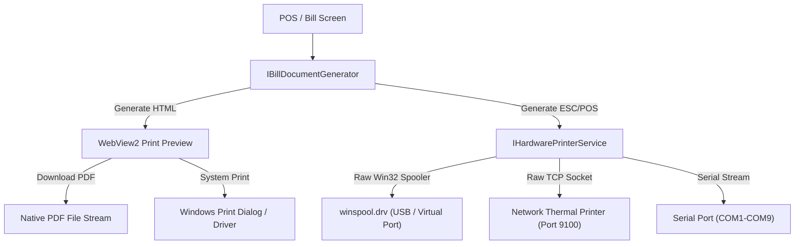

# Technical Design Specification: 100% Configurable Bill Customization, Print Preview with PDF Export & Real Hardware Printing

> **Author:** Antigravity AI Engine  
> **Date:** 2026-09-27  
> **Target Release:** Medistock-offlinefirst v1.2  
> **Status:** Proposed / Under Review  

---

## 1. Executive Summary & Objectives

This specification defines the complete end-to-end architecture for Medistock's **100% Configurable Bill Customization System**, **Interactive Print Preview & PDF Exporter**, and **Production-Grade Real Hardware Printer Pipeline**.

Pharmacies across India operate with vastly different billing formats: from 80mm/58mm thermal receipts at high-speed OTC counters, to multi-copy A4/A5 laser tax invoices for wholesale/institutional billing, down to pre-printed letterheads.

### Key Capabilities
1. **100% Bill Customization:** Granular control over every component:
   - **Header:** Store name, logo, address lines, contact numbers, GSTIN, DL numbers (20B/21B), FSSAI, PAN, bill titles (*Tax Invoice, Cash Memo, Estimate*), and alignments.
   - **Topbar / Metadata:** Invoice number, date, time, cashier, counter, prescribing doctor, doctor registration #, patient name, age/gender, phone, address, prescription reference, and payment modes.
   - **Line Items & Columns:** Complete column control: Serial #, Medicine Description, Packing, Manufacturer, Batch Number, Expiry Date, HSN/SAC Code, MRP, Selling Rate, Quantity, Free Quantity, Discount %, Discount ₹, GST %, CGST, SGST, IGST, Taxable Amount, Line Total. Each column can be individually toggled, renamed, reordered, resized, and aligned.
   - **Totals & Footer:** Subtotal, discount summary, savings callout (*"You saved ₹XX on this bill!"*), statutory HSN/GST tax breakdown table, round-off, amount in words, payment breakdown, bank details & dynamic UPI QR code, terms & conditions, and closing greetings.
   - **Signatures:** Pharmacist seal box, customer signature, and authorized signatory line.
   - **Styling & Paper:** A4 (Portrait/Landscape), A5 (Portrait/Landscape), 80mm Thermal, 58mm Thermal, custom font sizes, line heights, borders, and margins.
2. **Template Presets & Storage:** Default templates (*Standard A4 Pharmacy Invoice*, *Compact A5 Medical Memo*, *Fast 80mm POS Thermal*, *Minimal 58mm POS Slip*) stored in SQLite with full JSON export/import support.
3. **Print Preview & PDF Export:** Embedded WebView2-based live preview dialog with zoom controls, immediate PDF download/export capability via Chromium print-to-PDF engine.
4. **Real Hardware Printer Support:**
   - Real Windows Spooler integration via Win32 `winspool.drv` (RawPrinterHelper) to send raw ESC/POS commands directly to USB/COM/Virtual thermal printers without driver corruption.
   - Standard Windows printer driver support for A4/A5 laser/inkjet printers.
   - Direct raw TCP/IP socket printing (`IP:Port`, e.g. `192.168.1.100:9100`) for network receipt printers.
   - Paper auto-cut and cash drawer kick integration.

---

## 2. Core Data Models & Configuration Schema

All configurations are strongly typed and serializable to JSON for storage in SQLite and configuration sync.

### 2.1 Enums & Basic Types

```csharp
public enum PaperSize
{
    A4_Portrait,
    A4_Landscape,
    A5_Portrait,
    A5_Landscape,
    Thermal_80mm,
    Thermal_58mm,
    Custom
}

public enum TextAlignmentOption
{
    Left,
    Center,
    Right
}

public enum PrinterInterfaceType
{
    WindowsSpoolerRaw,    // USB / Driverless thermal via Win32 WritePrinter
    WindowsSystemDriver,  // Standard Windows print driver (Laser/Inkjet/A4)
    NetworkTcp,           // IP + Port 9100
    SerialCom             // COM1, COM2, etc.
}

public enum BillFieldType
{
    SrNo,
    ItemName,
    Packing,
    Manufacturer,
    BatchNumber,
    ExpiryDate,
    HsnCode,
    Mrp,
    UnitRate,
    Quantity,
    FreeQuantity,
    DiscountPercent,
    DiscountAmount,
    GstPercent,
    CgstAmount,
    SgstAmount,
    IgstAmount,
    TaxableAmount,
    TotalAmount
}
```

### 2.2 Granular Configuration Records

```csharp
public class BillTemplateConfig
{
    public string Id { get; set; } = Ulid.NewUlid().ToString();
    public string Name { get; set; } = "Standard A4 Tax Invoice";
    public bool IsDefault { get; set; } = true;
    public PaperSize PaperSize { get; set; } = PaperSize.A4_Portrait;

    // Layout & Margins
    public BillStyleConfig Styling { get; set; } = new();

    // Section Configurations
    public BillHeaderConfig Header { get; set; } = new();
    public BillMetadataConfig Metadata { get; set; } = new();
    public List<BillColumnConfig> Columns { get; set; } = new();
    public BillFooterConfig Footer { get; set; } = new();
    public BillTaxSummaryConfig TaxSummary { get; set; } = new();
    public BillSignatureConfig Signatures { get; set; } = new();
}

public class BillStyleConfig
{
    public string FontFamily { get; set; } = "'Segoe UI', 'Helvetica Neue', Arial, sans-serif";
    public double BaseFontSizePt { get; set; } = 10.0;
    public double MarginTopMm { get; set; } = 10.0;
    public double MarginBottomMm { get; set; } = 10.0;
    public double MarginLeftMm { get; set; } = 10.0;
    public double MarginRightMm { get; set; } = 10.0;
    public string PrimaryColorHex { get; set; } = "#1b5e20"; // Pharmacy Green
    public bool ShowTableBorders { get; set; } = true;
    public bool AlternateRowColors { get; set; } = true;
    public string Density { get; set; } = "Compact"; // "Compact", "Normal", "Comfortable"
}

public class BillHeaderConfig
{
    public bool IsVisible { get; set; } = true;
    public string StoreName { get; set; } = "MEDISTOCK PHARMACY";
    public string Tagline { get; set; } = "Complete Healthcare & Surgical Centre";
    public TextAlignmentOption Alignment { get; set; } = TextAlignmentOption.Center;
    public string AddressLine1 { get; set; } = "123, Healthcare Avenue, Opp. Civil Hospital";
    public string AddressLine2 { get; set; } = "MG Road, Mumbai - 400001, Maharashtra";
    public string Phone { get; set; } = "+91 98765 43210 / 022-28001122";
    public string Email { get; set; } = "contact@medistockpharmacy.com";
    
    // Logo
    public bool ShowLogo { get; set; } = false;
    public string? LogoBase64OrPath { get; set; }
    public double LogoMaxWidthPx { get; set; } = 120;
    public double LogoMaxHeightPx { get; set; } = 60;

    // Licenses & Identifiers
    public bool ShowGstin { get; set; } = true;
    public string GstinLabel { get; set; } = "GSTIN";
    public string Gstin { get; set; } = "27AAAAA0000A1Z5";

    public bool ShowDlNumbers { get; set; } = true;
    public string DlLabel { get; set; } = "D.L. Nos.";
    public string DlNumbers { get; set; } = "MH-MZ2-123456, MH-MZ2-123457 (20B/21B)";

    public bool ShowFssai { get; set; } = true;
    public string FssaiLabel { get; set; } = "FSSAI Lic No.";
    public string Fssai { get; set; } = "10019022009876";

    public bool ShowPan { get; set; } = false;
    public string Pan { get; set; } = "";

    // Document Type Titles
    public string SaleInvoiceTitle { get; set; } = "TAX INVOICE";
    public string EstimateTitle { get; set; } = "BILL OF SUPPLY / ESTIMATE";
    public string ReturnCreditNoteTitle { get; set; } = "CREDIT NOTE / SALES RETURN VOUCHER";
}

public class BillMetadataConfig
{
    public bool ShowInvoiceNo { get; set; } = true;
    public string InvoiceNoLabel { get; set; } = "Invoice No";

    public bool ShowInvoiceDate { get; set; } = true;
    public string InvoiceDateLabel { get; set; } = "Date";
    public string DateFormat { get; set; } = "dd-MMM-yyyy";

    public bool ShowInvoiceTime { get; set; } = true;
    public string TimeFormat { get; set; } = "hh:mm tt";

    public bool ShowCashier { get; set; } = true;
    public string CashierLabel { get; set; } = "Billed By";

    public bool ShowCounter { get; set; } = true;
    public string CounterLabel { get; set; } = "Counter";

    // Patient & Doctor Information
    public bool ShowCustomerName { get; set; } = true;
    public string CustomerNameLabel { get; set; } = "Patient Name";

    public bool ShowCustomerPhone { get; set; } = true;
    public string CustomerPhoneLabel { get; set; } = "Mobile";

    public bool ShowCustomerAddress { get; set; } = true;
    public string CustomerAddressLabel { get; set; } = "Address";

    public bool ShowCustomerGstin { get; set; } = true;
    public string CustomerGstinLabel { get; set; } = "Buyer GSTIN";

    public bool ShowDoctorName { get; set; } = true;
    public string DoctorNameLabel { get; set; } = "Prescribed By";

    public bool ShowDoctorRegNo { get; set; } = true;
    public string DoctorRegNoLabel { get; set; } = "Dr. Reg No";

    public bool ShowPrescriptionRef { get; set; } = true;
    public string PrescriptionRefLabel { get; set; } = "Rx Ref / Date";

    public bool ShowPaymentMode { get; set; } = true;
    public string PaymentModeLabel { get; set; } = "Pay Mode";
}

public class BillColumnConfig
{
    public BillFieldType FieldType { get; set; }
    public string HeaderTitle { get; set; } = "";
    public bool IsVisible { get; set; } = true;
    public int DisplayOrder { get; set; }
    public double WidthPercent { get; set; } // Percentage of table width
    public TextAlignmentOption Alignment { get; set; } = TextAlignmentOption.Left;
}

public class BillTaxSummaryConfig
{
    public bool ShowTaxTable { get; set; } = true;
    public bool ShowHsnBreakdown { get; set; } = true;
    public bool ShowCgstSgstSeparately { get; set; } = true;
    public bool ShowIgst { get; set; } = true;
}

public class BillFooterConfig
{
    public bool ShowTotalItems { get; set; } = true;
    public bool ShowTotalQuantity { get; set; } = true;
    public bool ShowSubtotal { get; set; } = true;
    public bool ShowTotalDiscount { get; set; } = true;
    public bool ShowSavingsCallout { get; set; } = true;
    public string SavingsTemplate { get; set; } = "🎉 You saved {SAVINGS_AMOUNT} on this bill!";

    public bool ShowRoundOff { get; set; } = true;
    public bool ShowGrandTotal { get; set; } = true;
    public bool ShowAmountInWords { get; set; } = true;

    // Payments & UPI QR
    public bool ShowPaymentBreakdown { get; set; } = true;
    public bool ShowBankDetails { get; set; } = false;
    public string BankDetailsText { get; set; } = "HDFC Bank | A/C: 50200012345678 | IFSC: HDFC0000123";

    public bool ShowUpiQrCode { get; set; } = true;
    public string UpiId { get; set; } = "pharmacy@upi";
    public string UpiPayeeName { get; set; } = "Medistock Pharmacy";

    // Terms and Greetings
    public bool ShowTermsAndConditions { get; set; } = true;
    public string TermsAndConditionsText { get; set; } = 
        "1. Goods once sold will not be returned without original cash memo.\n" +
        "2. Consult physician before consuming Schedule H/H1 medicines.\n" +
        "3. Keep medicines away from sunlight and moisture.\n" +
        "4. Subject to local jurisdiction only.";

    public bool ShowGreeting { get; set; } = true;
    public string GreetingText { get; set; } = "*** THANK YOU & GET WELL SOON ***";
}

public class BillSignatureConfig
{
    public bool ShowPharmacistSign { get; set; } = true;
    public string PharmacistSignTitle { get; set; } = "Registered Pharmacist";

    public bool ShowCustomerSign { get; set; } = false;
    public string CustomerSignTitle { get; set; } = "Receiver's Signature";

    public bool ShowAuthorizedSign { get; set; } = true;
    public string AuthorizedSignTitle { get; set; } = "For MEDISTOCK PHARMACY\nAuthorized Signatory";
}
```

---

## 3. Database Persistence & Default Presets

### 3.1 Migration `008_BillCustomizationAndPrinters.sql`

```sql
CREATE TABLE IF NOT EXISTS bill_templates (
    id TEXT PRIMARY KEY NOT NULL,
    name TEXT NOT NULL,
    is_default INTEGER NOT NULL DEFAULT 0,
    paper_size TEXT NOT NULL,
    config_json TEXT NOT NULL,
    created_at TEXT NOT NULL,
    updated_at TEXT NOT NULL
);

CREATE TABLE IF NOT EXISTS printer_configurations (
    id TEXT PRIMARY KEY NOT NULL,
    name TEXT NOT NULL,
    interface_type TEXT NOT NULL, -- WindowsSpoolerRaw, WindowsSystemDriver, NetworkTcp, SerialCom
    target_name_or_ip TEXT NOT NULL, -- Printer Name (e.g. "EPSON TM-T82") or IP (e.g. "192.168.1.100")
    target_port INTEGER DEFAULT 9100,
    paper_size TEXT NOT NULL,
    assigned_template_id TEXT,
    auto_cut_paper INTEGER NOT NULL DEFAULT 1,
    kick_cash_drawer INTEGER NOT NULL DEFAULT 1,
    is_default_pos INTEGER NOT NULL DEFAULT 0,
    is_default_a4 INTEGER NOT NULL DEFAULT 0,
    created_at TEXT NOT NULL,
    updated_at TEXT NOT NULL,
    FOREIGN KEY(assigned_template_id) REFERENCES bill_templates(id)
);
```

### 3.2 Built-In Factory Default Presets
1. **`Preset_A4_Standard`**: Comprehensive Indian GST Tax Invoice with all 19 columns available (10 enabled by default), doctor/patient metadata, HSN tax summary, bank details, and pharmacist seal.
2. **`Preset_A5_Compact`**: Two-column topbar, concise item table (Sr, Name, Batch, Exp, Qty, Rate, Total), small tax breakdown, and compact terms.
3. **`Preset_Thermal_80mm`**: Optimized 48-column thermal slip for high-speed POS with auto-cut and UPI QR code.
4. **`Preset_Thermal_58mm`**: Ultra-compact 32-column slip for small receipt printers.

---

## 4. Bill Rendering & Generation Engine

### 4.1 HTML5/CSS Dynamic Document Generator
The `BillDocumentGenerator` transforms a `SaleReceiptModel` and `BillTemplateConfig` into responsive, self-contained HTML5 with inline CSS and vector SVG QR codes.

```csharp
public interface IBillDocumentGenerator
{
    Task<string> GenerateHtmlBillAsync(SaleReceiptModel receipt, BillTemplateConfig config);
    Task<byte[]> GenerateEscPosBillAsync(SaleReceiptModel receipt, BillTemplateConfig config);
    Task<string> ConvertAmountToWordsInrAsync(decimal amount);
}
```

### 4.2 Dynamic Column Layout Algorithm
The column generation loop dynamically constructs the `<table>` header and body rows based solely on `config.Columns.Where(c => c.IsVisible).OrderBy(c => c.DisplayOrder)`.
Values are formatted precisely (e.g., currency with ₹ symbol, dates as `MM/yy`, percentages as `X%`, quantities with decimal trimming).

---

## 5. Real Hardware Printer Pipeline

### 5.1 Architecture



### 5.2 Real Windows Spooler Helper (`RawPrinterHelper`)
For thermal printers (Epson, TVS, TSC, Posiflex, Bixolon, Xprinter, Rongta), sending standard Windows GDI text results in driver scaling and rasterization lag. We implement `RawPrinterHelper` using Win32 API calls (`OpenPrinter`, `StartDocPrinter`, `StartPagePrinter`, `WritePrinter`, `EndPagePrinter`, `EndDocPrinter`, `ClosePrinter`) with `DOCINFO` DataType `"RAW"` to stream pure binary ESC/POS directly to the print spooler.

### 5.3 Real Hardware Device Discovery
- Enumerate all installed Windows printers via `System.Drawing.Printing.PrinterSettings.InstalledPrinters` and Win32 `EnumPrinters`.
- Report printer status (Online/Offline/Default/Port name).
- Provide a "Test Print" button sending a diagnostic receipt.

---

## 6. WinUI 3 UI / UX Customizer & Print Preview Studio

### 6.1 Bill Customization Studio (`BillCustomizerPage.xaml`)
A split-screen visual editor in Settings:
- **Left Panel (Control Tabs):**
  - **Paper & Styling:** Paper size dropdown, font family, font size slider, margins, accent color picker, borders toggle, density selector.
  - **Header & Branding:** Store name, logo uploader, address lines, phone/email, GSTIN, DL, FSSAI, doc titles.
  - **Metadata & Patient:** Toggle checkboxes and customizable labels for all topbar fields.
  - **Columns Manager:** Interactive table with Drag/Reorder, Visibility Checkboxes, Custom Title inputs, Alignment selectors, and Width % adjustments.
  - **Totals & Footer:** Tax breakdown toggle, savings banner format, bank details, UPI ID for QR, terms & conditions editor.
  - **Signatures:** Signatory labels and checkbox toggles.
- **Right Panel (Live Interactive Preview):**
  - Embedded `WebView2` showing instant live rendering as any control on the left is modified.
  - Template selector (Switch between A4, A5, 80mm, 58mm).
  - "Save Changes" and "Export Template (JSON)" / "Import Template (JSON)" buttons.

### 6.2 Print Preview & Download Dialog (`PrintPreviewDialog.xaml`)
- Launched from POS checkout, Sales History, or Customizer Studio.
- Displays full WYSIWYG bill in `WebView2`.
- Action Buttons:
  - **📥 Download PDF:** Prompts file save dialog (`.pdf`) and generates high-resolution vector PDF using WebView2's `PrintToPdfAsync`.
  - **🖨️ Quick Print (Default):** Prints immediately to assigned default POS/A4 printer.
  - **⚙️ Print with Options:** Allows selecting printer, paper size, and number of copies.
  - **✖️ Close / ESC.**

---

## 7. Verification & Testing Strategy

1. **Unit & Integration Tests (`Medistock.Infrastructure.Tests`):**
   - Verify serialization/deserialization of `BillTemplateConfig` with all 19 columns and custom properties.
   - Test `BillDocumentGenerator.GenerateHtmlBillAsync` output validity across all 4 default presets (A4, A5, 80mm, 58mm).
   - Test INR currency to words conversion (e.g. `₹1,452.50` $\rightarrow$ `"One Thousand Four Hundred Fifty-Two Rupees and Fifty Paise Only"`).
   - Test ESC/POS generator respecting custom column orders and widths.
   - Test RawPrinterHelper mock/stream verification.
2. **Desktop UI Tests & Verification:**
   - Verify Live Template changes reflect instantly in WebView2.
   - Verify PDF export produces a valid `.pdf` file.
   - Verify Windows printer enumeration and test print dispatcher.

---

## 8. Summary Checklist
- [x] 100% Configurable Header (Store, Logo, DLs, GSTIN, Titles)
- [x] 100% Configurable Topbar Metadata (Rx, Doctor, Patient, Cashier, Date/Time)
- [x] 100% Configurable Columns (19 fields with toggle, rename, reorder, width, align)
- [x] 100% Configurable Footer, Totals, Tax HSN Table, UPI QR & Terms
- [x] 100% Configurable Signatures (Pharmacist, Customer, Auth Sign)
- [x] 4 Factory Presets (A4, A5, 80mm, 58mm) + SQLite persistence + JSON export
- [x] High-res Vector PDF Download in Print Preview
- [x] Real Hardware Printer Support (Win32 Spooler RAW, Windows Driver, TCP Socket)
